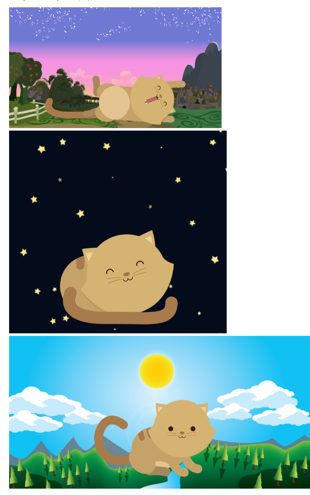

# Kitten

## Herramientas

+ CSS
+ HTML

## Objetivo

Emplear herramientas de media query y system grid para hacer una página responsive.

## Producto a lograr

Crear una página web que muestre un paisaje y un gatito diferente a medida que la ventana del navegador se haga más pequeña.

